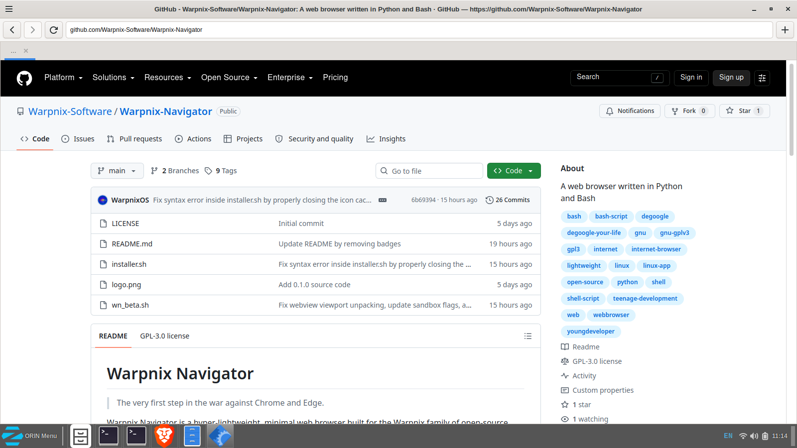

 # Warpnix Navigator
> The very first step in the war against Chrome and Edge.

Warpnix Navigator is a hyper-lightweight, minimalist deGoogled web browser built for the Warpnix family of open-source software (including [WarpnixOS](https://github.com/Warpnix-Software/WarpnixOS)). Built using **Python**, **Bash**, **GTK3**, and **WebKit**, it strips away mainstream browser bloat (I'm lookin' at you, Chrome!) for a fast, system-native experience.

---

## Preview
   

---

## Security by Default
* **Hardened Privacy:** Automatically denies and blocks all background webpage access requests to your system camera, microphone, and geolocation out of the box.
* **Lightweight Architecture:** Uses the native WebKit2GTK rendering engine to keep RAM consumption incredibly low, using just under 200 megabytes of memory on idle.

## Installing

Warpnix Navigator is currently Linux-exclusive. Install the required system dependencies for your distribution:

### Debian / Ubuntu / Linux Mint
```bash
sudo apt install python3 python3-gi python3-gi-cairo gir1.2-gtk-3.0 gir1.2-webkit2-4.1 zenity
```

### Fedora / RHEL / Fedora Atomic
```bash
sudo dnf install python3 python3-gobject gtk3 webkit2gtk4.1 zenity
```
OR
```bash
sudo rpm install python3 python3-gobject gtk3 webkit2gtk4.1 zenity
```
### Arch Linux
```bash
sudo pacman -S python python-gobject gtk3 webkit2gtk zenity
```

### Setup & Execution
Clone the repository, make the script executable, and run the browser:

```bash
git clone https://github.com/Warpnix-Software/Warpnix-Navigator.git
cd Warpnix-Navigator
chmod +x wn_beta.sh
./wn_beta.sh
```

---

## Keyboard Shortcuts
* `Alt` + `T` : Open a new tab
* `Alt` + `W` : Close active tab
* `Alt` + `R` : Reload page
* `Alt` + `Left Arrow` : Go back
* `Alt` + `Right Arrow` : Go forward

---

##  Roadmap
* **0.2.x — OS X Support:** Expand to more Unix-like and Unix-based operating systems and improve portability.
* **0.3.x — BSD Support:** Adapt platform integration and interface behavior.
* **0.4.x and Beyond:** Long-term targets include Windows, ReactOS, and Haiku.

## Contributing
Warpnix Navigator is licensed under the GPL-3.0 License. Bug reports and feature requests are completely welcome—feel free to open an issue or submit a pull request!

## Find me on YouTube @WarpdevOfficial

### Thanks for using Warpnix Navigator!
